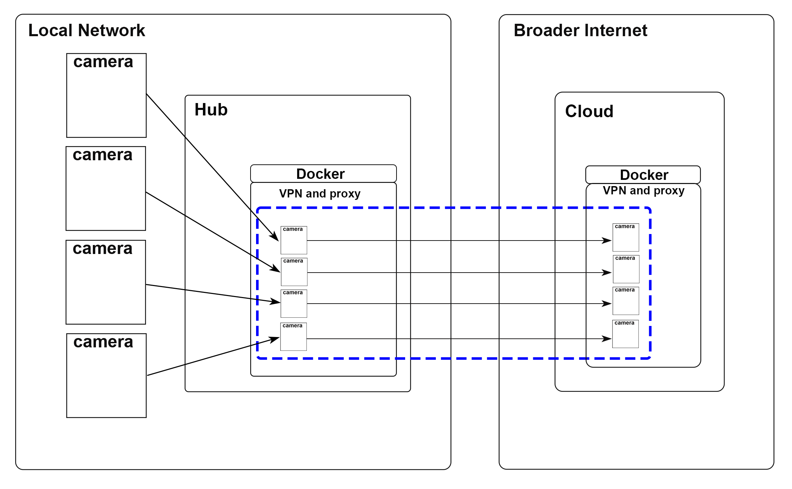

# A Set of dockerfiles to easily and securely proxy your raspberry pi based cameras to the internet

 First Docker container runs on a raspberry pi on your local network and proxies all your cameras to be accessible through an nginx server running in the container. Second container runs on a remote server that is accessible through the open internet. The tinc vpn service creates a secure connection between your local container and the server and nginx proxies the your local nginx server running on the raspberry pi. This allows you to access your cameras from anywhere in the world without any weird port forwarding or other hacks.

## Setup
1. generate keys and exchange them in the tinc hosts folder.
      "sudo tincd -n netname -K4096"
2. add server ip address to server file in hosts folder and to tinc.conf for server
3. run container with docker compose

Better instructions to come in the future

